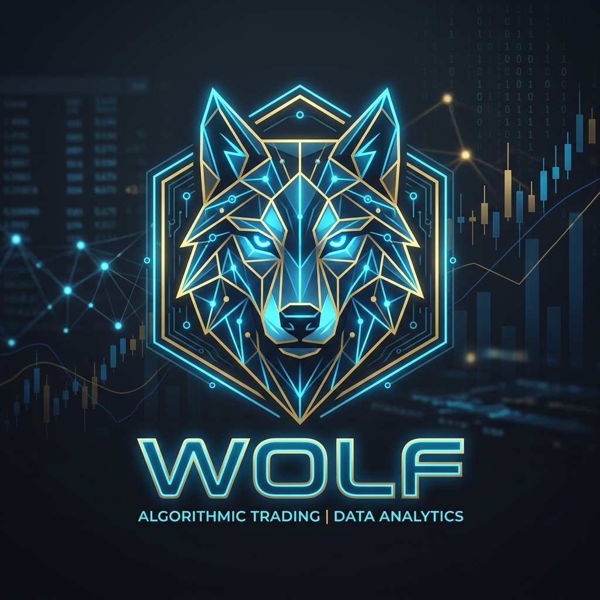

<p align="center">
  
</p>

# 🐺 Wolf-Data-Storage: Trading Analysis & Bot Development Roadmap

[](https://www.python.org/)
[](https://binance-docs.github.io/apidocs/spot/en/)
[](https://www.metatrader5.com/en)
[](https://opensource.org/licenses/MIT)

Welcome to the **Wolf-T-Analyst & Bot** repository. This document serves as a comprehensive roadmap, technical blueprint, and architectural guide for building robust, automated trading systems. 

Our focus spans two major asset classes and their respective platforms:
1. **Cryptocurrencies** via the **Binance API**.
2. **Forex & Commodities (e.g., XAUUSD)** via **MetaTrader 5 (MT5)**.

---

## 📑 Table of Contents
- [1. Trading Analysis Data & Storage](#-1-trading-analysis-data--storage-the-wolf-ecosystem)
- [2. Crypto Bot Development Path](#-2-crypto-bot-development-path-binance)
- [3. Forex & Commodities Bot Path](#-3-forex--commodities-bot-development-path-metatrader-5)
- [4. Deployment & Maintenance](#-4-deployment--maintenance-roadmap)
- [5. Repository Structure & Setup](#-5-repository-structure--setup)

---

## 📊 1. Trading Analysis Data & Storage (The "Wolf" Ecosystem)

Before executing trades, high-quality, structured market data must be gathered, stored, and analyzed with precision.

### 1.1. Core Concepts
- **MSNR (Market Structure and Narrative)**: The foundational logic driving our algorithmic analysis. Bots rely on the precise identification of Market Structure Shifts (MSS), Breaks of Structure (BOS), and Liquidity Purges.
- **Multi-Timeframe (MTF) Alignment**: Data is analyzed across multiple timeframes (e.g., M5, M15, H1, H4) to enforce strict "3 Clocks" directional alignment.
- **Data Sources**:
  - **Historical Data**: Tick data and OHLCV from Binance (Crypto) and MT5 (Forex/Metals).
  - **Real-Time Streams**: WebSockets for low-latency live tick and order book data.

### 1.2. Data Storage Pipeline
1. **Ingestion Layer**: Connect to external APIs (Binance REST/WS, MT5 Python Integration) for robust real-time streaming.
2. **Storage Layer**: 
   - *Relational (SQL)*: Optimized for structured historical OHLCV data, backtesting results, and immutable trade logs.
   - *Time-Series (e.g., InfluxDB/TimescaleDB)*: Dedicated to high-frequency tick data and streaming real-time indicator values.
3. **Analytics Engine**: Python-based modules (Pandas/NumPy) dedicated to calculating EMAs, engulfing patterns, and identifying high-probability Category 1 (QMS) and Category 2 (Continuation) setups.

---

## 📈 2. Crypto Bot Development Path (Binance)

Binance offers robust REST and WebSocket APIs. Our bots will primarily focus on Spot or USDⓈ-M Futures markets.

### 2.1. Prerequisites & Setup
- **API Keys**: Generate API keys on Binance with strict permissions (Reading, Futures/Spot Trading). 
  > ⚠️ **Security Note:** *Never expose these keys in public repositories.*
- **Tech Stack**: Python utilizing the `python-binance` library.
- **Infrastructure**: Cloud servers (AWS/DigitalOcean) ensuring 24/7 uptime to handle WebSockets without network interruptions.

### 2.2. Development Phases
- **Phase 1: Connection & Data Streaming**
  - Establish WebSocket connections for live K-line (candlestick) data on target pairs (e.g., BTCUSDT, ETHUSDT).
  - Implement resilient connection failure and auto-reconnection logic.
- **Phase 2: Signal Generation (The Analyst)**
  - Route streamed data through the MSNR engine.
  - Detect internal/external breakouts and monitor for trigger events (e.g., EMA crossovers, candlestick rejections).
- **Phase 3: Execution Engine**
  - Map signals to optimal execution types (Market vs. Limit orders).
  - Enforce risk management: Calculate dynamic position sizing, Stop Loss (SL), and Take Profit (TP) levels based on account equity.
- **Phase 4: Monitoring & Logging**
  - Persist all raw signals and executed trades to the Wolf-Data-Storage database.
  - Integrate Discord/Telegram webhooks for real-time trade alerts and automated daily PnL reports.

---

## 💱 3. Forex & Commodities Bot Development Path (MetaTrader 5)

MT5 provides native support for Forex and Commodities (e.g., XAUUSD) via the officially supported Python integration.

### 3.1. Prerequisites & Setup
- **Broker Setup**: MT5 terminal configured with an ECN broker account featuring ultra-low spreads (essential for scalping/intraday strategies).
- **Integration Choice**: 
  - *Primary Path (Pure Python)*: Utilizing the `MetaTrader5` Python library to maintain a unified codebase alongside the Binance bot.
  - *Alternative Path (MQL5 EA)*: Direct MQL5 development for ultra-low latency execution via HTTP signal requests.

### 3.2. Development Phases
- **Phase 1: Terminal Connection & Asset Initialization**
  - Initialize MT5 context via Python (`mt5.initialize()`).
  - Verify symbol visibility in Market Watch and pre-fetch required historical data for indicator baselines.
- **Phase 2: Live Tick & Rate Polling**
  - Implement a highly optimized polling loop using `mt5.copy_rates_from_pos()` to simulate live candle updates efficiently.
- **Phase 3: MSNR Signal Adaptation**
  - Calibrate signal logic for specific asset volatility (e.g., Gold). Adjust QMS and Continuation setups to account for spread widening during volatile sessions (e.g., NY open).
- **Phase 4: Order Routing**
  - Translate analytic signals into precise MT5 trade requests (`mt5.order_send()`).
  - Implement strict handling for slippage, magic numbers (bot identification), and exact point/pip calculations for SL/TP execution.

---

## 🚀 4. Deployment & Maintenance Roadmap

### 4.1. Backtesting & Forward Testing
- **Backtesting**: Rigorously validate the MSNR logic against 2+ years of historical data to establish baseline win rates and maximum drawdowns.
- **Paper Trading**: Deploy the bot on Binance Testnet and MT5 Demo accounts for a mandatory minimum of 2 weeks of forward testing.

### 4.2. Live Deployment
- **Containerization**: Package the entire Python application stack using Docker.
- **Cloud Hosting**: Deploy to low-latency Virtual Private Servers (VPS) geographically co-located near exchange matching engines (e.g., London for Forex, Tokyo/AWS for Binance).

### 4.3. Continuous Improvement
- **Machine Learning Integration**: Leverage the extensive historical database within `Wolf-Data-Storage` to train models for anomaly detection and dynamic parameter optimization.
- **Web Dashboard**: Develop a frontend UI (React/Next.js) connected to the database to visualize bot performance, active portfolio positions, and historical MSNR setups.

## 📂 5. Repository Structure & Setup

### 5.1. Directory Layout
The repository is structured to separate data ingestion, analysis, execution, and testing:
- **`src/`**: Contains core Python modules.
  - `data_ingestion/`: Modules for streaming/polling data from Binance and MT5.
  - `msnr_engine/`: Analytical logic for detecting MSS, BOS, and alignments.
  - `execution/`: Order routing, risk management, and dynamic position sizing.
- **`config/`**: Configuration management securely loading variables.
- **`tests/`**: Unit tests and backtesting framework.
- **`notebooks/`**: Jupyter notebooks for exploratory data analysis (EDA) and strategy prototyping.

### 5.2. Local Setup Instructions
1. **Environment Setup**: Copy `.env.example` to `.env` and fill in your API credentials.
   ```bash
   cp .env.example .env
   ```
2. **Install Dependencies**: Install the required Python packages:
   ```bash
   pip install -r requirements.txt
   ```

---

<div align="center">
  <b>Developed for the Wolf-T-Analyst Ecosystem</b><br>
  <i>Last Updated: May 2026</i>
</div>
